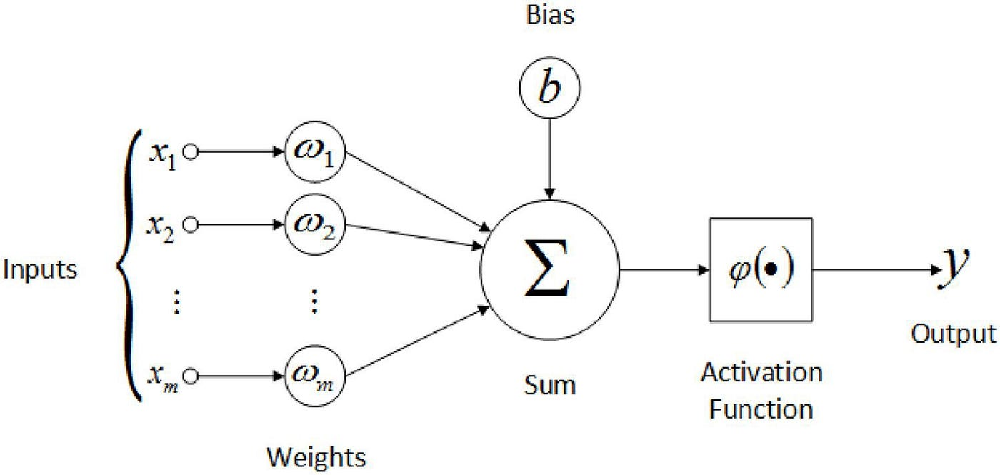
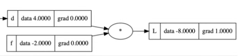

# Creation of a LLM using Transformers from Scratch

\- Tokenizer

\- Embedding

\- Self Attention

\- Transformer

\- Trainer

\- Inference

## 1 Neuron class (Scalar)
(easiest one)

For the neuron class creation we need the following parameters:
- weights
- bias

I have y = wx + b 
with :
x --> input
w --> weights
b --> bias
y --> output of the neuron

### Issue
Then i need to implement activation functions but it makes me realize i have no way of following operation for backpropagation so i need to creat a 'Automatic differenciation / Tape based autodiff' like in pytorch or the value class in Karpathy's videos

# 1 Automatic differenciation
***(Using Karpathy's structure but i make it up to date by adding exponential, tanh, log, sigmoid, leaky_relu), Also like pytorch do i need a with torch.no_grad mode,  and optimizer()***

zeroing of gradients is already implemented in his code --> usefull for zeroing between epochs.

##  Backpropagation Explanation

Les définitions d'opérations consistent à refaire les opérations en utilisant la classe `Value` qui contient l'historique pour chaque valeur.

Ici on veut le gradient de **L** la sortie. Le gradient de la sortie par rapport à elle-même est **1**.  
On veut ensuite le gradient de **d** $\rightarrow$ $\frac{dL}{dd}$. 

Or $L = d \cdot f$ donc $\frac{dL}{dd} = f$.  
Donc le gradient de **d** est **-2**.

On a maintenant **d** de l'exemple précédent qui est le résultat de l'opération $d = c + e$.  
On cherche le gradient de **c**. Donc on veut $\frac{dL}{dc}$ et on connaît déjà $\frac{dL}{dd}$, il manque $\frac{dd}{dc}$.

Comme $d = c + e$, alors $\frac{dd}{dc} = 1$.

## Chain Rule :
$$\frac{dz}{dx} = \frac{dz}{dy} \cdot \frac{dy}{dx}$$

Donc pour obtenir le résultat final il suffit de multiplier tous les gradients intermédiaires.  
Donc le gradient de **c** $= 1 \cdot -2 = -2$.

## Tri

Maintenant on veut backpropagate mais il faut que tout les nodes avant soient traités avant de faire les suivants. On utilise un tri topologque. Puis calculer les gradients en suivant ce tri en partant de la sortie.

# Next steps

0. passer en numpy le core pour efficacité computationnelle    

1. batching

2. la tokenization et embedding

3. Fonction de pertes (cross entropy)

4. les classes d'attention (head puis multi avec masquage)

5. la classe transformer (avec residual connections et layer normalization)

6. Fonction generate 

# Change from Value to tensored values
We were calculating each value but its to slow for a LLM. SO we will now use tensor
Value --> Tensor
Neuron --> Linear
Layer --> Linear
loops for neurons --> vectorisation

## Tensor

A tensor is 

### Add mul and broadcasting
When we add to matrix if they are different size there is automatically broadcasting. Example: $A = \begin{pmatrix} 1 & 1 & 1 \\ 1 & 1 & 1 \\ 1 & 1 & 1 \end{pmatrix}$ (shape `(3,3)`) et $B = \begin{pmatrix} 2 & 2 & 2 \end{pmatrix}$ (shape `(3,)`). If we do A + B numpy will stretch B to 
$$B_{stretched} = \begin{pmatrix} 2 & 2 & 2 \\ 2 & 2 & 2 \\ 2 & 2 & 2 \end{pmatrix}$$
So for the backward pass we will need to unbroadcast to get the good size for the gradient.
To do that we need to do the opposite of stretching, we will compress the matrix. In fact it's called unboradcasting. To do that we compare the shapes of our gradient and target shape. We have 2 cases:
#### case 1 :
$W = X + Y = \begin{pmatrix} x_{11} & x_{12} \\ x_{21} & x_{22} \end{pmatrix} + \begin{pmatrix} y_1 & y_2 \end{pmatrix} = \begin{pmatrix} x_{11} + y_1 & x_{12} + y_2 \\ x_{21} + y_1 & x_{22} + y_2 \end{pmatrix}$
**Gradient formatting of x+y:**

**For $X$ :** nothing to do
**For $Y$ :** $grad$ of $X+Y$ : `(2, 2)` $\rightarrow \begin{pmatrix} g_{11} & g_{12} \\ g_{21} & g_{22} \end{pmatrix}$
  * We want it $Y$ : `(2,)` $\rightarrow \begin{pmatrix} y_1 & y_2 \end{pmatrix}$
  
**Solution :** Y contributed by columns so we sum vertically :
$$gradY = \begin{pmatrix} g_{11} + g_{21} & g_{12} + g_{22} \end{pmatrix}$$

#### case 2 :
**Forward :**
$W = X + Y = \begin{pmatrix} x_{11} & x_{12} \\ x_{21} & x_{22} \end{pmatrix} + \begin{pmatrix} y_1 \\ y_2 \end{pmatrix} = \begin{pmatrix} x_{11} + y_1 & x_{12} + y_1 \\ x_{21} + y_2 & x_{22} + y_2 \end{pmatrix}$

> `res = grad.sum(axis=0)`

**Gradient formatting of x+y:**
* **Pour $X$ :** Nothing
* **Pour $Y$ :** $grad$ of $X+Y$ : `(2, 2)` $\rightarrow \begin{pmatrix} g_{11} & g_{12} \\ g_{21} & g_{22} \end{pmatrix}$

  * We want  $Y$ : `(2, 1)` $\rightarrow \begin{pmatrix} y_1 \\ y_2 \end{pmatrix}$
  
**Solution :** we sum horizontally :
$$gradY = \begin{pmatrix} g_{11} + g_{12} \\ g_{21} + g_{22} \end{pmatrix}$$
> `res = grad.sum(axis=1, keepdims=True)`

### matmul and backward
Matmultiplication is usefull as it schuffle columns but not lines. It's the A @ B opération so a matrix multiplication.

We have $X = \begin{pmatrix} x_1 & x_2 \\ x_3 & x_4 \end{pmatrix}$ and $W = \begin{pmatrix} w_1 \\ w_2 \end{pmatrix}$

$Y = X @ W = \begin{pmatrix} y_1 \\ y_2 \end{pmatrix} = \begin{pmatrix} x_1 w_1 + x_2 w_2 \\ x_3 w_1 + x_4 w_2 \end{pmatrix}$

We have $grad\_out = \begin{pmatrix} g_1 \\ g_2 \end{pmatrix}$ And we want: $grad(W) = chain\_rule * derivative\ of\ y\ according\ to\ w = grad(Y) * \frac{\partial Y}{\partial W}$

So for $\frac{\partial Y}{\partial w_1}$ and $\frac{\partial Y}{\partial w_2}$:

$w_1$ influence $x_1$ and $x_3$. To show it in a mathematically intuitive way we will be using local derivative.

**Derivatives/Jacobian of Y :**
We have $Y_{ik} = \sum X_{ij} W_{jk}$
So locals are $\frac{\partial Y_i}{\partial W_j} = X_{ij}$

| | $\frac{\partial}{\partial w_1}$ | $\frac{\partial}{\partial w_2}$ |
| :--- | :---: | :---: |
| $\partial y_1$ | $x_1$ | $x_2$ |
| $\partial y_2$ | $x_3$ | $x_4$ |

So for $grad(w_1) = g_1 x_1 + g_2 x_3$
and $grad(w_2) = g_1 x_2 + g_2 x_4$

$grad(W) = \begin{pmatrix} grad(w_1) \\ grad(w_2) \end{pmatrix} = \begin{pmatrix} g_1 x_1 + g_2 x_3 \\ g_1 x_2 + g_2 x_4 \end{pmatrix}$

We can see:
$grad(W) = \begin{pmatrix} x_1 & x_3 \\ x_2 & x_4 \end{pmatrix} \begin{pmatrix} g_1 \\ g_2 \end{pmatrix} = X^T \cdot grad\_out$

### Linear

Linear is a combination of matmul and add
Y = X @ W + B

### Softmax

Softmax is calculated horizontally (normalization on lines/rows).

**Formula:**
For a matrix element $Z_{ij}$, the Softmax (with numerical stability) is:

$$\text{softmax}(Z_{ij}) = \frac{\exp(Z_{ij} - \max(Z_{i \cdot}))}{\sum_{k} \exp(Z_{ik} - \max(Z_{i \cdot}))}$$

**Components:**
- $\exp(Z_{ij} - \max(Z_{i \cdot})) = \text{exps}$
- $\sum \exp(Z_{ik} - \max(Z_{i \cdot})) = \text{sum by line (normalization factor)}$

**Example:**
$X = \begin{pmatrix} 10 & 11 \\ 5 & 2 \end{pmatrix}$

1. **Max by line:** $\begin{pmatrix} 11 \\ 5 \end{pmatrix}$

2. **Exps ($e^{z - \max}$):**
- Line 1: $(e^{10-11}, e^{11-11}) = (e^{-1}, e^{0}) \approx (0.37, 1)$
- Line 2: $(e^{5-5}, e^{2-5}) = (e^{0}, e^{-3}) \approx (1, 0.05)$
Result: $\begin{pmatrix} 0.37 & 1 \\ 1 & 0.05 \end{pmatrix}$

3. **Sum by line:**
- Line 1: $0.37 + 1 = 1.37$
- Line 2: $1 + 0.05 = 1.05$

4. **Final Softmax:**
$$\text{Softmax} = \begin{pmatrix} 0.37/1.37 & 1/1.37 \\ 1/1.05 & 0.05/1.05 \end{pmatrix} \approx \begin{pmatrix} 0.27 & 0.73 \\ 0.95 & 0.05 \end{pmatrix}$$

#### Derivative Softmax

Gj = out_grad
Pj = out
J are inputs and i are outputs.

$\frac{\partial L}{\partial Z_j} = P_j \cdot (G_j - \sum (G_i \cdot P_i))$

and the sum is also on the lines

### CrossEntropy  (and Advanced Indexation)

$$Loss = -\frac{1}{N} \sum_{i=1}^{N} \log(p_{i, target})$$

with :
P_i --> output probs
Y_i --> ground truth

We will regroup the formula by n lines to calculate the loss. These are the batch.
***Backward*** 
[Backward of a softmax](https://medium.com/data-science/derivative-of-the-softmax-function-and-the-categorical-cross-entropy-loss-ffceefc081d1) :

$\frac{\partial L}{\partial Z} = P_i - Y_i$

1. Getting Y_i
Using a loop is not a good option we will improve the process
We have :

|| P(classe 0) | P(classe 1) |P(classe 2) |
| :--- | :---: | :---: | :---: |
| image 0 | 0.1|***0.7***|0.4|
| image 1 |0.2 |0.2|***0.5***|
| image 2 | ***0.8***|0.1|0.3|

We want :
$\begin{pmatrix} 0.7 \\ 0.5 \\ 0.8 \end{pmatrix}$

#### Example to justify vectorisation
If ***probs*** is :
 
|| |  |
| :--- | :---: | :---: |
| car (0)| ***0.7***|0.4|
| cat (1)|0.2 | ***0.8*** |
| bird (2)| 0.1|0.1|

Instead of doing :

    results = []
    for i in targets:
        results.append(probs.data[i,target(i)])
It's a line by line code
We can do :

    [np.arange(batch_size), targets] 

That way we take (0,0) and get 0.7
same wuth (1,1) --> 0.5
--> (0.7,0.5)

numpy vectorized speed pu the process

***Back to the Backward***
When we have the logits we remove 1 it's the minus Y of the equation. (It's due to the fact in a binary classification True = 1 / False = 0)

Example :
If we took 2 lines/batches

|example| grad|  meaning|
| :--- | :---: | :---: |
| im1| 0.8|the gradient tells W needs to go 0.8 up|
| im2| 0.2|the gradient tells W needs to go 0.2 up|

So now we have cross entropy for each lines but  im1 and im2 where calculated in the same batch during the forward pass using the mean. If we sum the grads IM1 will have more influence than im2 as the result will be 0.8+0.2=1. To avoid that we devide by batch number so here 0.5 and you can see it makes more sense.

### Optimizer

### ReLu / GeLu

for GeLu: https://docs.pytorch.org/docs/stable/generated/torch.nn.GELU.html
https://arxiv.org/pdf/1606.08415
https://alaaalatif.github.io/2019-04-11-gelu/

### Layernorm

y=Var[x]+ϵ​x−E[x]​⋅γ+β

### Test

tensor_test folder was created with Gemini

# Next steps
- torch_no grad
- pushing to github

## Sources

- What i remember from Andrej Karpathy videos on the subject

- also https://medium.com/@prxdyu/simple-neural-network-in-python-from-scratch-2814443a3050

- https://huggingface.co/blog/andmholm/what-is-automatic-differentiation

## What i learnt in the project

- pip freeze > requirements.txt   --> take installed versions and write them in requirements.txt
